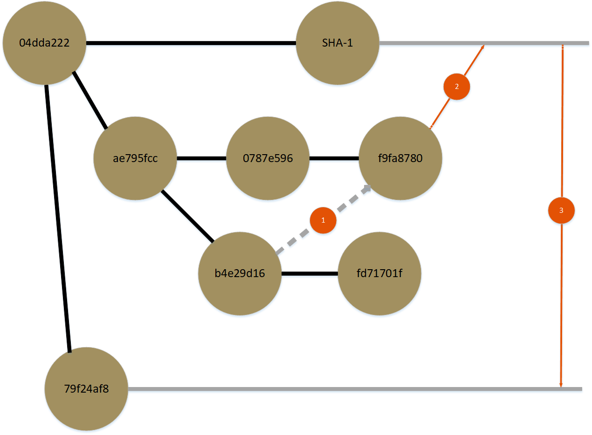

# git - Intermediate Practice

This repository is meant to be used as a small assortment of exercises to reinforce git commands and strategies common in enterprise development projects.

The contents of this project are nonsensical text documents structured into specific branches and commits that present a specific set of scenarios that require cherry-picking and rebasing to finish preparing the base for _master_.

Following the steps below will provide a developer with practice in the following commands:
```bash
$ git cherry-pick
$ git merge
$ git rebase
$ git mergetool
```

## How to participate:



> In master, we hope to eventually include Ginsberg poetry, but exclude any mention of wine...
This means that we don't wish to include the second commit from _cherry-pick-from_, but we need its first one.

1.) Cherry pick the first commit found on _cherry-pick-from_ into _cherry-pick-to_

> We do appreciate Jimi Hendrix & the writing on Futurama, so we can keep everything else from _cherry-pick-to_.
At this point, we can take all of our commits from _cherry-pick-to_ to master.

2.) Merge _cherry-pick-to_ into _master_

> It took the developer working on Latin updates some time to research the best Latin advice from our lingual ancestors.
Many updates have made it into master by the time we were ready to promote code from _perform-rebase-on_.

3.) Rebase _master_ into _perform-rebase-on_, using a merge tool to handle the merge conflict

4.) Merge _perform-rebase-on_ into _master,_ honoring both downstream branches' changes
